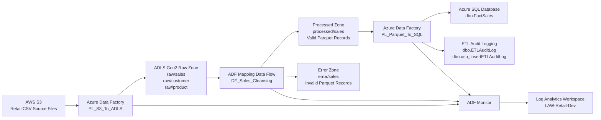

# Architecture Diagram: Azure Retail Data Engineering Pipeline

## 1. High-Level Architecture



## 2. Pipeline Flow

The project follows this processing flow:

```text
AWS S3 source files
  ↓
ADF ingestion pipeline
  ↓
ADLS Gen2 raw zone
  ↓
ADF Mapping Data Flow transformation
  ↓
Processed Parquet output and error Parquet output
  ↓
Azure SQL Database load
  ↓
SQL audit logging
  ↓
ADF Monitor and Log Analytics
```

## 3. Main Components

| Component | Purpose |
|---|---|
| AWS S3 | Stores source retail CSV files |
| Azure Data Factory | Orchestrates ingestion, transformation, SQL load, audit logging, and trigger execution |
| ADLS Gen2 Raw Zone | Stores original source files copied from AWS S3 |
| ADF Mapping Data Flow | Cleans, validates, deduplicates, and transforms sales records |
| Processed Zone | Stores valid transformed sales records as Parquet |
| Error Zone | Stores invalid/rejected sales records as Parquet |
| Azure SQL Database | Stores processed sales records in `dbo.FactSales` |
| ETL Audit Log | Stores pipeline execution details in `dbo.ETLAuditLog` |
| Log Analytics Workspace | Stores ADF diagnostic logs for monitoring |

## 4. Notes

The `curated` and `archive` containers were created for future extension. In the current implementation, the SQL load uses processed sales data from:

```text
processed/sales/
```

The customer and product files are copied into the raw zone for future extension. The main transformation and SQL loading implementation focuses on the sales dataset.
